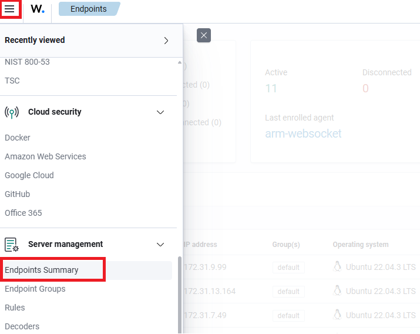
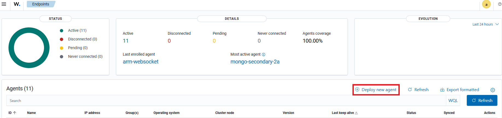
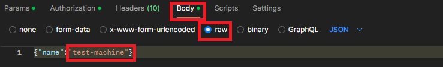
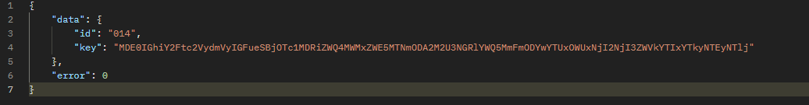

# How to Deploy a Wazuh Agent Connected to a Wazuh Kubernetes Deployment: A Step-by-Step Guide 🕹

## Description

Enhancing your security monitoring with Wazuh agents connected to a Wazuh manager in Kubernetes? This comprehensive guide will walk you through the process of deploying Wazuh agents and connecting them to a Wazuh manager running in a Kubernetes cluster, ensuring comprehensive security monitoring across your environment.

By the end of this guide, you'll have Wazuh agents deployed and connected to your Wazuh manager in Kubernetes, providing robust security monitoring for your environment. Let's get started!

## Prerequisites 🪬:-

+ **Kubernetes Cluster:** A running Kubernetes cluster with Wazuh manager deployed. If you don't have a Wazuh manager deployed yet, refer to the "Deploying Wazuh in Kubernetes" guide.

+ **Wazuh Manager Endpoint:** The IP address or DNS name of the Wazuh manager running in your Kubernetes cluster.

+ **Postman Installed:** Postman, the API development tool, installed on your local machine for testing API connections.

## Steps 🎎:-

**Step 1** — Install the Agent

Login to Wazuh Web UI


Click the burger button, below "Server Management" go to "Endpoint Summary"



Go to "Deploy new agent"



Then the Wazuh dashboard will show you the steps to deploy a new agent.

**Step 2** — Request token using Postman

Generate the token using Postman


Copy the generated token.

**Step 3** — Import the key to the agent

Add this to Postman


Then, Click "Authorization" option, choose "Bearer Token" Auth Type and paste the token from step 2.


Click "Body", choose "raw" option and paste this text:

```
{"name":"<AGENT_NAME>"}
```

For example:



Lastly, click "Send"

Result:



Copy the key.

**Step 4** — Configuring agent

Login to agent using CLI tool.

Add the key.

```
/var/ossec/bin/manage_agents -i <key>
```

Sample Output:

```
Agent information:
        ID:001
        Name:agent_1
        IP Address:any
    Confirm adding it?(y/n): y
    Added.
```

Add the Wazuh manager IP address to the agent configuration file in /var/ossec/etc/ossec.conf


**Note:** For port, this is the port number of the wazuh-workers in kubernetes


Restart the agent to make the changes effective.

systemctl restart wazuh-agent

**Step 5** — Verify

Login to Wazuh Web IU.

Select the **Server management** > **Endpoints Summary** module to check for the newly enrolled agent and its connection status in the Wazuh dashboard to confirm that enrollment was successful.

## Final Note

If you find this repository useful for learning, please give it a star on GitHub. Thank you!

**Authored by:** [ELemenoppee](https://github.com/ELemenoppee)