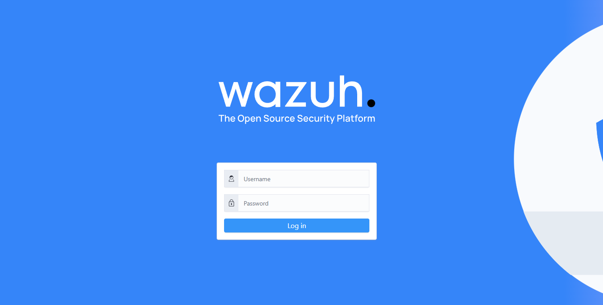
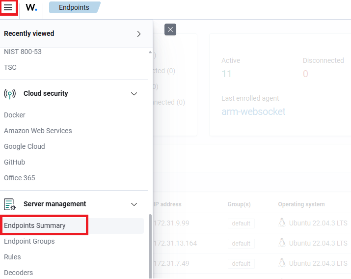
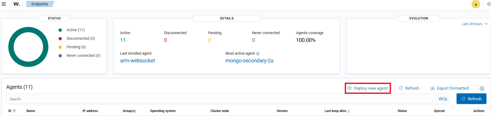
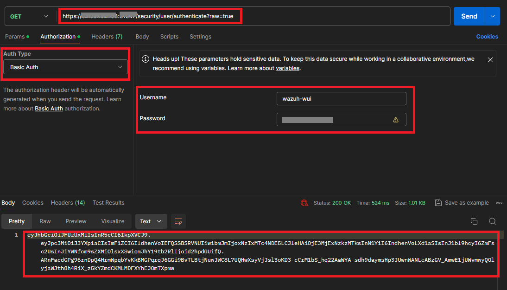
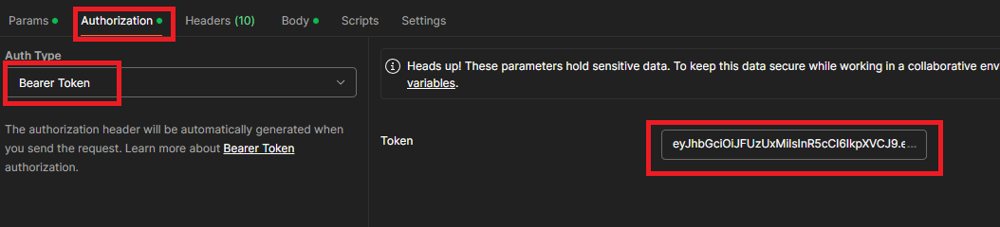
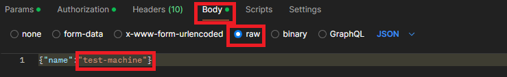
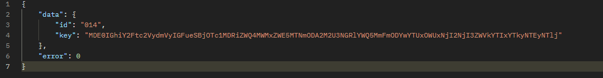
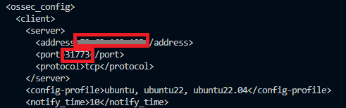
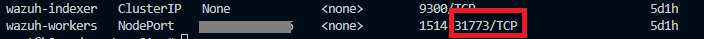

# How to Install the Wazuh Agent on Windows: A Step-by-Step Guide

## Introduction

Looking to enhance your security monitoring on Windows systems with Wazuh? This comprehensive guide will walk you through the process of installing the Wazuh agent on a Windows machine, ensuring you can leverage Wazuh's powerful security features to monitor and protect your Windows environment.

By the end of this guide, you'll have the Wazuh agent installed and configured on your Windows machine, providing robust security monitoring and protection. Let's get started!

## Prerequisites 🪬:-

+ **Wazuh Manager Endpoint:** The IP address or DNS name of the Wazuh manager to which the agent will connect.

+ **Windows Machine:** A Windows machine with administrative access to install and configure the agent.

+ **Postman Installed:** Postman, the API development tool, installed on your local machine for testing API connections.

Once you have these prerequisites in place, you are ready to proceed with installing the Wazuh agent on Windows.

## Steps 🎎:-

**Step 1** — Install the Agent

Login to Wazuh Web UI



Navigate to "Endpoint Summary" under "Server Management".



Click "Deploy new agent".



The Wazuh dashboard will display the steps to deploy a new agent.

**Step 2** — Request token using Postman

Generate the token using Postman.



Copy the generated token.

**Step 3** — Import the key to the agent

Add the token to Postman.


Select "Bearer Token" under the "Authorization" tab and paste the token from Step 2.



In the "Body" tab, choose "raw" and paste:

```
{"name":"<AGENT_NAME>"}
```

For example:



Click "Send".

Result:



Copy the key.

**Step 4** — Configure the Agent

Login to the agent using the CLI tool.

Import the key. The installation directory depends on the system architecture:

+ C:\Program Files (x86)\ossec-agent for 64-bit systems.

+ C:\Program Files\ossec-agent for 32-bit systems.

From the Wazuh agent, run CMD or PowerShell as an administrator and import the key:

```
& "C:\Program Files (x86)\ossec-agent\manage_agents.exe" -i <key>
```

Sample Output:

```
Agent information:
        ID:001
        Name:agent_1
        IP Address:any
    Confirm adding it?(y/n): y
    Added.
```

Add the Wazuh manager IP address to the agent configuration file located at C:\Program Files (x86)\ossec-agent\ossec.conf.



**Note:** Specify the port number for the Wazuh workers in Kubernetes.



Restart the agent to apply the changes.

Powershell (as an administrator)

```
Restart-Service -Name wazuh
```

CMD (as an administrator)

```
net stop wazuh
net start wazuh
```

**Step 5** — Verify

Login to Wazuh Web IU.

Go to **"Server Management"** > **"Endpoints Summary"** to check the new agent's connection status on the Wazuh dashboard and confirm successful enrollment.

## Final Note

If you find this repository useful for learning, please give it a star on GitHub. Thank you!

**Authored by:** [ELemenoppee](https://github.com/ELemenoppee)